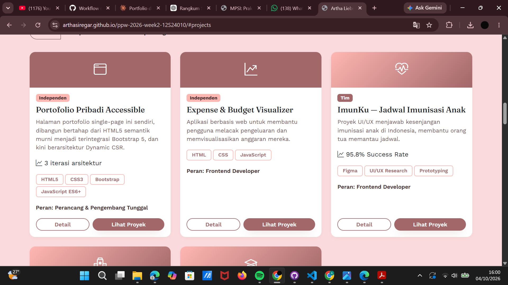
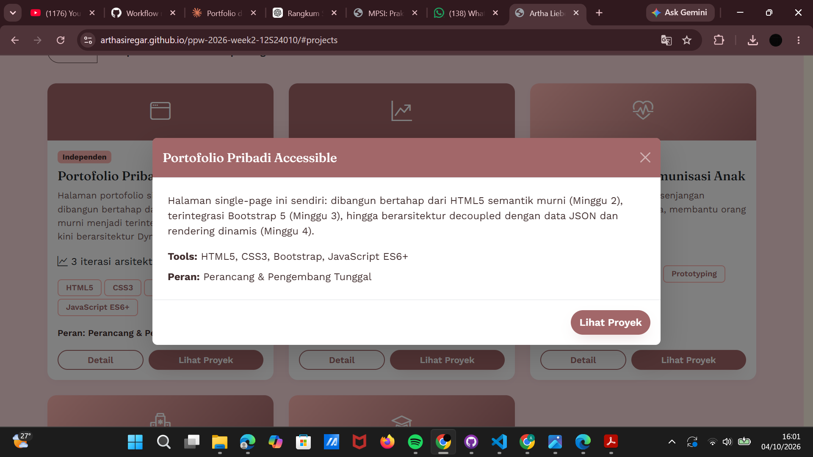
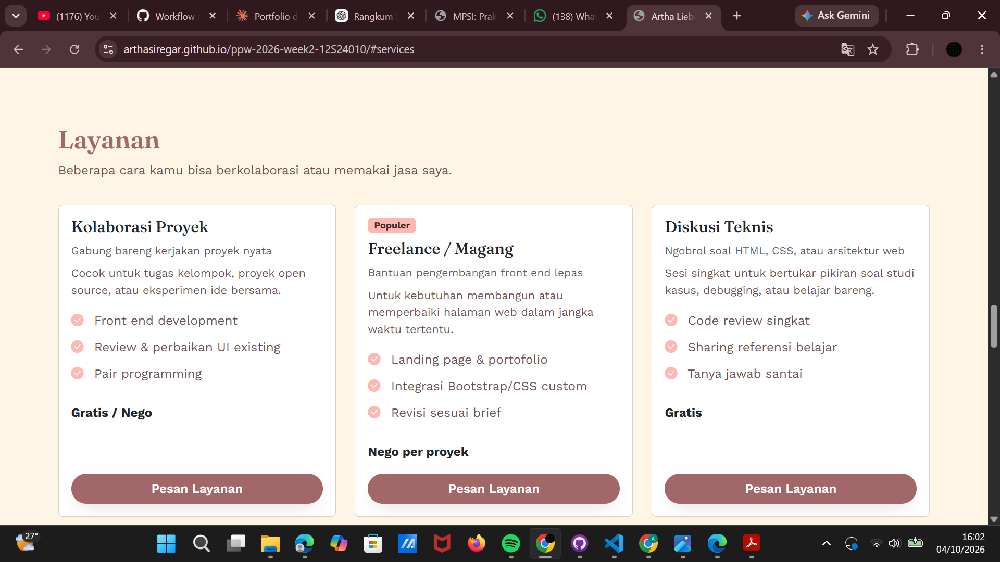
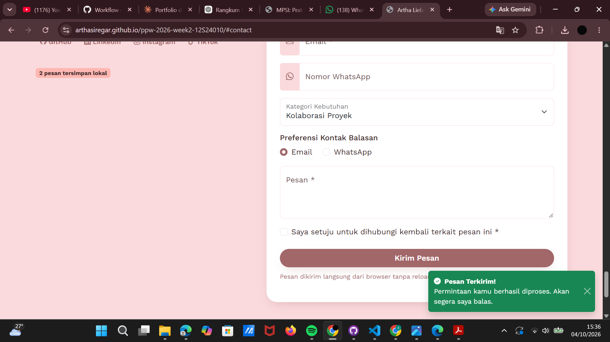
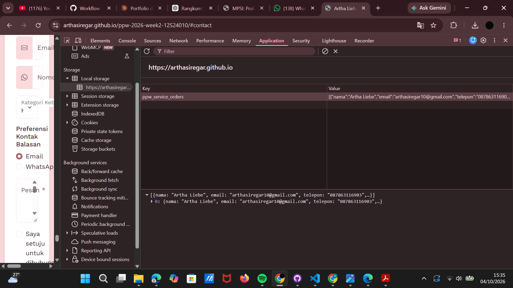
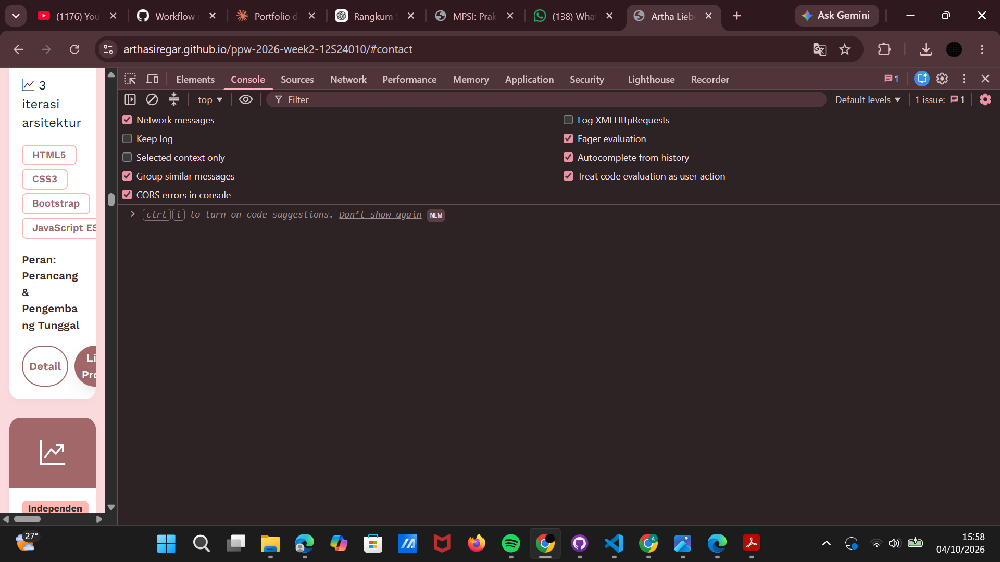
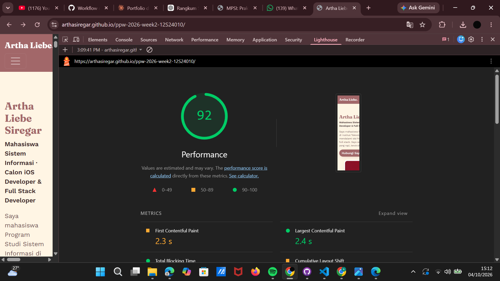
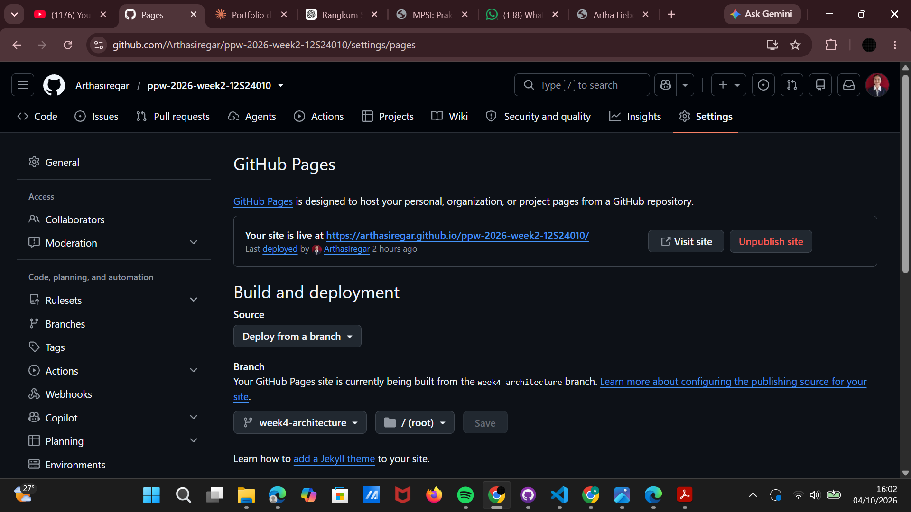

# Portofolio & Service Portal — Artha Liebe Siregar

**NIM:** 12S24010 · **Kelas:** 13SI1 · **Mata Kuliah:** 12S3101 Pemrograman dan Pengujian Web
**Tugas:** Minggu 4 — Refactoring Arsitektural: Decoupled Multi-Tier, Dynamic Client-Side Rendering (CSR), dan Network Performance Profiling

| | |
|---|---|
| 🔗 **Live demo** | https://arthasiregar.github.io/ppw-2026-week2-12S24010/ |
| 🔗 **Repositori** | https://github.com/Arthasiregar/ppw-2026-week2-12S24010/tree/week4-architecture |
| 🌿 **Branch** | `week4-architecture` |

> Repositori ini adalah kelanjutan dari proyek Minggu 2 dan Minggu 3. Nama repositori `week2` dipertahankan agar riwayat commit dan URL GitHub Pages tetap sama. Seluruh pekerjaan Minggu 4 berada di branch `week4-architecture`.

---

## 1. Ringkasan Pembaruan Minggu 4

Pada Minggu 3, portofolio dibangun dengan Bootstrap 5.3, tetapi seluruh konten (bio, keahlian, kartu proyek, modal, pengalaman, pendidikan, kontak) masih **hardcoded** di `index.html` (monolitik statis). Pada Minggu 4, `index.html` diubah menjadi **shell kosong**, dan seluruh konten diambil secara asinkron dari berkas JSON lalu dirakit di browser (Client-Side Rendering).

Perubahan utama:

- Data dipisah ke `data/profile.json`, `data/projects.json`, dan `data/services.json`.
- Kode dipisah menjadi **Data Access Layer** (`js/api-service.js`) dan **Presentation Layer** (`js/app.js`).
- Pengambilan data memakai `fetch()` dengan `async/await` dan penanganan error defensif.
- **4 UI State** pada bagian proyek: Loading, Success, Empty, Error.
- **Filter kategori** instan (Semua / Independen / Tim / Berpasangan).
- **Universal Dynamic Modal**: 1 modal untuk semua proyek (menggantikan 5 modal terpisah).
- Section baru **Layanan** (Service Portal) dari `services.json`.
- Form kontak dikirim lewat **fetch POST** (JSON) tanpa reload, dengan umpan balik **Toast**, dan riwayat pesanan disimpan di **localStorage**.
- **Content Security Policy** (CSP) dan sanitasi masukan untuk mencegah DOM-based XSS.
- **Profiling jaringan** di DevTools (cold vs warm load, status 304, TTFB, FCP) dan optimasi foto profil dari 430 kB menjadi 49 kB.

---

## 2. Diagram Arsitektur — C4 Container Model


> Jika diagram Mermaid tidak tampil di GitHub, ekspor lewat [mermaid.live](https://mermaid.live) sebagai gambar lalu simpan di `docs/c4-container.png`.

### Pemetaan ke Arsitektur Multi-Tier

| Tier | Komponen di proyek ini | Tanggung jawab |
|---|---|---|
| **Presentation Tier** | `index.html`, `css/custom-style.css`, `js/app.js` | Antarmuka, responsivitas, interaksi, UI states |
| **Application / API Logic Tier** | `js/api-service.js`, `httpbin.org/post` | Kontrak pengambilan dan pengiriman data, error handling, endpoint REST mock |
| **Data Storage Tier** | `data/*.json` (sumber), `localStorage` (state sisi klien) | Penyimpanan data portofolio dan riwayat pesanan |

### Narasi Separation of Concerns (SoC)

Pada Minggu 3, satu berkas `index.html` menanggung tiga tanggung jawab sekaligus: struktur, konten, dan perilaku. Mengubah satu judul proyek berarti mengedit markup di dua tempat (kartu dan modal), sehingga rawan tidak konsisten.

Pada Minggu 4, tanggung jawab dipisah menjadi lapisan yang masing-masing punya satu alasan untuk berubah:

1. **Data** (`data/*.json`) berubah ketika konten berubah. Menambah proyek cukup dengan menambah satu objek JSON, tanpa menyentuh HTML atau JavaScript.
2. **Data Access Layer** (`api-service.js`) berubah ketika cara mengambil data berubah, misalnya endpoint pindah ke backend sungguhan. `app.js` tidak perlu diubah karena hanya memanggil fungsi `ApiService`.
3. **Presentation Layer** (`app.js`) berubah ketika tampilan atau interaksi berubah.
4. **Struktur dan gaya** (`index.html`, `custom-style.css`) hanya mengurus kerangka dan tema visual.

Manfaatnya: kode lebih mudah dirawat, data dan tampilan dapat diuji terpisah, dan satu sumber kebenaran (single source of truth) menghilangkan duplikasi antara kartu dan modal.

### Komparasi Paradigma Rendering

| Parameter | SSR | CSR (proyek ini) | Jamstack |
|---|---|---|---|
| Perakitan DOM | Di server per request | Di browser via JavaScript | Saat build, lalu dihidrasi via API |
| Beban server | Tinggi | Sangat rendah (hanya mengirim berkas statis dan JSON) | Minimal (disajikan CDN) |
| TTFB | Menengah–lambat | Cepat (HTML shell kecil) | Sangat cepat |
| Interaktivitas | Reload tiap navigasi | Mulus, filter dan modal instan | Mulus |
| Hosting | Server aktif terus | Static hosting (GitHub Pages) | Static CDN + serverless/API |
| Kelemahan | Beban server, reload | Konten kosong sebelum JS selesai; SEO lebih lemah | Perlu proses build |

Proyek ini memakai **CSR di atas static hosting** yang cocok dengan pola Jamstack: HTML shell disajikan statis, data diambil dari JSON, dan form dikirim ke REST endpoint eksternal.

---

## 3. Tabel Perbandingan: Sebelum vs Sesudah Refactoring

| Aspek | Sebelum (Minggu 3) | Sesudah (Minggu 4) |
|---|---|---|
| **Arsitektur** | Monolitik statis, semua konten di `index.html` | Decoupled multi-tier: shell HTML + JSON + Data Access Layer + Presentation Layer |
| **Sumber data** | Hardcoded di HTML | `data/profile.json`, `data/projects.json`, `data/services.json` |
| **Kartu proyek** | 5 kartu ditulis manual | Dirender dinamis dari `projects.json` (CSR) |
| **Modal proyek** | 5 modal terpisah (`modalPortofolio`, `modalExpense`, `modalImunku`, `modalClinic`, `modalAcademic`) | 1 modal universal (`universalProjectModal`), isi diinjeksi berdasarkan ID proyek |
| **UI State** | Tidak ada | Loading, Success, Empty, Error |
| **Filter proyek** | Tidak ada | Filter kategori instan tanpa reload |
| **Section Layanan** | Tidak ada | Ada, dari `services.json` |
| **Form kontak** | `action="mailto:"` membuka aplikasi email | `fetch` POST berisi JSON ke REST endpoint, tanpa reload |
| **Umpan balik form** | Validasi Bootstrap saja | Validasi, tombol loading, dan Toast |
| **State klien** | Tidak ada | Riwayat pesanan di `localStorage` |
| **JavaScript** | Skrip validasi inline | Modul terpisah `api-service.js` dan `app.js` |
| **Keamanan** | Tanpa CSP | CSP via `<meta>`, sanitasi dengan `escapeHTML` / `textContent` / `safeUrl` |
| **Foto profil** | 430 kB | 49 kB (dikompres) |
| **Struktur folder** | `index.html` + `custom-style.css` | `css/`, `js/`, `data/`, `assets/`, `docs/` |
| **Menambah proyek** | Edit HTML di dua tempat (kartu + modal) | Tambah satu objek di `projects.json` |

---

## 3A. Desain Data Layer JSON

Seluruh konten berada di `data/` dan dibaca lewat `ApiService` (`fetch` + `async/await`, error dilempar dengan pesan HTTP yang jelas).

| Berkas | Isi | Jumlah |
|---|---|---|
| `profile.json` | `name`, `role`, `bio`, `facts[]`, `techStack[]`, `canDo[]`, `contact`, `socials[]`, `education[]`, `experience[]` | 1 objek |
| `projects.json` | `id`, `title`, `category`, `accent`, `icon`, `image`, `description`, `detail`, `tags[]`, `role`, `metric`, `year`, `status`, `link` | 5 proyek |
| `services.json` | `id`, `name`, `tagline`, `description`, `price`, `features[]`, `highlight` | 3 paket layanan |

Contoh satu entri `projects.json`:

```json
{
  "id": "imunku",
  "title": "ImunKu — Jadwal Imunisasi Anak",
  "category": "Tim",
  "accent": "coral",
  "icon": "bi-heart-pulse",
  "image": null,
  "tags": ["Figma", "UI/UX Research", "Prototyping"],
  "role": "Frontend Developer",
  "metric": "95.8% Success Rate",
  "year": 2026,
  "status": "Selesai",
  "link": "https://docs.google.com/presentation/d/..."
}
```

Nilai `category` (`Independen`, `Tim`, `Berpasangan`) dipakai langsung oleh tombol filter, dan `id` dipakai Universal Modal untuk menemukan proyek yang diklik. Jika `image` kosong, kartu memakai banner ikon (`icon`) sebagai pengganti.

---

## 4. Struktur Berkas

```
ppw-2026-week2-12S24010/
├── index.html                  # Shell HTML5 + Bootstrap 5, tanpa kartu hardcoded
├── css/
│   └── custom-style.css        # Tema, CSS variables, override Bootstrap
├── data/
│   ├── profile.json            # Biodata, fakta singkat, keahlian, pengalaman, pendidikan, kontak
│   ├── projects.json           # Koleksi proyek
│   └── services.json           # Katalog paket layanan
├── js/
│   ├── api-service.js          # Data Access Layer (fetch GET/POST, error handling)
│   └── app.js                  # Presentation Layer (render, filter, modal, form, toast)
├── assets/
│   ├── images/photo-almetdel.jpg
│   └── CV_ARTHA_SIREGAR.pdf
├── docs/                       # Screenshot bukti (waterfall, Lighthouse, form, storage, dll.)
└── README.md
```

> Catatan: GitHub Pages membedakan huruf besar dan kecil pada nama berkas. `CV_ARTHA_SIREGAR.pdf` harus persis sama dengan yang dipanggil di `index.html`.

---

## 5. Fitur Utama dan Bukti Fungsional

- **Dynamic CSR** — hero, keahlian, proyek, layanan, pengalaman, pendidikan, dan kontak dirender dari JSON memakai `async/await`.
- **4 UI State pada proyek**
  - *Loading*: spinner "Memuat data proyek…"
  - *Success*: grid kartu responsif (`row-cols-1 row-cols-md-2 row-cols-lg-3`)
  - *Empty*: pesan jika kategori filter tidak berisi proyek
  - *Error*: alert merah jika JSON gagal dimuat
- **Filter kategori** — Semua, Independen, Tim, Berpasangan.
- **Universal Dynamic Modal** — satu modal, isi berubah sesuai ID proyek, dibuka lewat Bootstrap Modal API.
- **Service Portal** — katalog layanan dari `services.json`. Tombol "Pesan Layanan" mengisi kategori dan pesan di form secara otomatis, lalu menggulir halaman ke form kontak.
- **Pemuatan data paralel** — profil, layanan, dan proyek dimuat bersamaan dengan `Promise.allSettled`, sehingga kegagalan satu berkas tidak menghentikan section lain.
- **Form REST asinkron** — `preventDefault`, validasi, serialisasi ke JSON, `fetch` POST ke `https://httpbin.org/post`, tombol submit berubah menjadi status "Mengirim…", Toast sukses atau gagal, lalu form direset.
- **Persistensi lokal** — pesanan (maksimal 10 terakhir) disimpan di `localStorage` dan ditampilkan lewat badge di bagian kontak.
- **Aksesibilitas** — skip link, HTML semantik, label form, `aria-label`, `role="alert"`.
- **Tema** — palet cream, pink, koral, dan mauve melalui CSS custom properties, tanpa `!important`.

### Bukti hasil di live demo

**Grid proyek yang dirender dari `projects.json`**



**Universal Dynamic Modal** (satu modal, isi berubah sesuai proyek yang diklik)



**Section Layanan dari `services.json`**



**Toast sukses dan badge pesanan setelah form dikirim** (halaman tidak reload)



**Riwayat pesanan tersimpan di `localStorage`** (key `ppw_service_orders`)



**Console bersih dari error** pada live demo



---

## 6. Keamanan Sisi Klien

### Sanitasi DOM-based XSS
Nilai dari JSON yang disisipkan ke DOM diperlakukan sebagai data tidak tepercaya:

- Teks biasa (nama, peran, bio, judul modal, kontak) memakai `textContent`.
- Jika harus memakai `innerHTML` (template kartu, modal, layanan, toast), setiap nilai dinamis dilewatkan fungsi `escapeHTML()` terlebih dahulu. Fungsi ini mengganti `& < > " '` sehingga aman dipakai pada isi elemen maupun nilai atribut HTML.
- URL dari JSON (`link`, `url`) divalidasi lewat `safeUrl()`: hanya protokol `http` dan `https` yang diterima, nilai seperti `javascript:` diganti `#`.
- Endpoint `httpbin.org` hanya mock REST untuk praktikum; data yang dikirim adalah data formulir kontak.

### Content Security Policy

| Direktif | Nilai | Alasan |
|---|---|---|
| `default-src` | `'self'` | Blokir semua sumber luar secara default |
| `style-src` | `'self' 'unsafe-inline' https://cdn.jsdelivr.net https://fonts.googleapis.com` | Bootstrap, Bootstrap Icons, Google Fonts; `unsafe-inline` dipakai untuk atribut `style` pada Toast container dan textarea |
| `font-src` | `'self' https://fonts.gstatic.com https://cdn.jsdelivr.net` | File font Google Fonts dan Bootstrap Icons |
| `script-src` | `'self' https://cdn.jsdelivr.net` | Hanya skrip lokal dan Bootstrap JS; tanpa skrip inline |
| `img-src` | `'self' data:` | Gambar lokal dan data URI |
| `connect-src` | `'self' https://httpbin.org https://cdn.jsdelivr.net` | `fetch` ke JSON lokal, REST endpoint mock, dan source map Bootstrap |

---

## 7. Pengukuran Network Profiling (DevTools)

**Lingkungan uji:** URL live https://arthasiregar.github.io/ppw-2026-week2-12S24010/ · Microsoft Edge (tab Network) dan Google Chrome (Lighthouse dan pengujian form) · tanpa throttling · jaringan pribadi.

- **Cold Load**: *Disable cache* dicentang, lalu *hard reload* (`Ctrl+Shift+R`).
- **Warm Load**: *Disable cache* dimatikan, lalu muat ulang biasa (`F5`) setelah pemanasan cache.
- Tiap kondisi diukur **3 kali**, dan nilai yang dilaporkan adalah **nilai tengah (median)** karena hasil sangat dipengaruhi kondisi jaringan.
- TTFB dibaca dari tab *Timing* → *Waiting for server response* pada request dokumen `index.html`.

### 7.1 Cold Load vs Warm Load

**Data tiap percobaan**

| Kondisi | Percobaan | Requests | Transferred | DOMContentLoaded | Load | TTFB |
|---|---|---|---|---|---|---|
| Cold | 1 | 17 | 391 kB | 1.650 ms | 1.960 ms | 331,26 ms |
| Cold | 2 | 17 | 391 kB | 2.520 ms | 2.840 ms | 323,29 ms |
| Cold | 3 | 17 | 390 kB | 4.910 ms | 4.910 ms | 735,76 ms |
| Warm | 1 | 17 | 467 B | 240 ms | 260 ms | 132,75 ms |
| Warm | 2 | 17 | 414 B | 346 ms | 368 ms | 320,68 ms |
| Warm | 3 | 17 | 460 B | 2.040 ms | 2.060 ms | 1.010 ms |

**Ringkasan (nilai tengah)**

| Metrik | Cold Load | Warm Load | Selisih |
|---|---|---|---|
| TTFB `index.html` | 331,26 ms | 320,68 ms | 10,58 ms (hampir sama) |
| First Contentful Paint (FCP) | 2,3 s (Lighthouse) | tidak diukur terpisah* | — |
| DOMContentLoaded | 2.520 ms | 346 ms | 2.174 ms (≈ 86% lebih cepat) |
| Load | 2.840 ms | 368 ms | 2.472 ms (≈ 87% lebih cepat) |
| Jumlah request | 17 | 17 | 0 |
| Data ditransfer | 391 kB | 460 B | ≈ 390,5 kB (≈ 99,9% lebih kecil) |

\* Lighthouse selalu mensimulasikan muat halaman dengan kondisi bersih, sehingga FCP kondisi warm tidak diukur terpisah.

Rentang antar percobaan cukup lebar (Load cold 1,96–4,91 s; Load warm 0,26–2,06 s). Perbedaan ini berasal dari kondisi jaringan saat pengukuran, bukan dari perubahan kode, sehingga median dipakai sebagai nilai representatif.

### 7.2 Analisis Caching per Berkas

| Berkas | Status Cold | Status Warm | `Cache-Control` | `ETag` | Keterangan |
|---|---|---|---|---|---|
| `index.html` | 200 (5,1 kB) | **304** (211 B) | `max-age=600` | Ada | Divalidasi ke server karena reload `F5` selalu memvalidasi dokumen utama |
| `css/custom-style.css` | 200 (3,2 kB) | 200 (0 B) | `max-age=600` | Ada | Dilayani dari cache lokal, masih dalam masa `max-age` |
| `js/app.js` | 200 (5,0 kB) | 200 (0 B) | `max-age=600` | Ada | Dari cache lokal |
| `js/api-service.js` | 200 (1,3 kB) | 200 (0 B) | `max-age=600` | Ada | Dari cache lokal |
| `data/projects.json` | 200 (1,7 kB) | **304** (74 B) | `max-age=600` | Ada | Selalu divalidasi karena `fetch` memakai `cache: 'no-cache'` |
| `data/profile.json` | 200 (1,4 kB) | **304** (101 B) | `max-age=600` | Ada | Selalu divalidasi (`no-cache`) |
| `data/services.json` | 200 (0,8 kB) | **304** (74 B) | `max-age=600` | Ada | Selalu divalidasi (`no-cache`) |
| `bootstrap.min.css` (CDN jsDelivr) | 200 (33,5 kB) | 200 (0 B) | `public, max-age=31536000, s-maxage=31536000, immutable` | Ada | Cache selama 1 tahun dan bersifat immutable |

Total data warm load berasal dari empat respons 304: 211 + 74 + 101 + 74 = 460 B, sama dengan angka *transferred* pada DevTools.

### 7.3 Analisis

**Efisiensi bandwidth.** Pada warm load, data yang ditransfer turun dari 391 kB menjadi 460 B (≈ 99,9%). Seluruhnya hanya berupa respons `304 Not Modified` tanpa body untuk dokumen dan ketiga berkas JSON. Aset statis lain (CSS, JS, font, gambar, Bootstrap) dilayani dari cache lokal tanpa request ke server karena masih dalam masa `max-age`.

**Dampak pada waktu.** Median Load turun dari 2.840 ms menjadi 368 ms (≈ 87%). Namun median TTFB hampir tidak berubah (331 ms vs 321 ms), karena dokumen dan JSON tetap harus bertanya ke server untuk validasi. Artinya, caching menghemat *bandwidth* dan waktu unduh, tetapi tidak menghilangkan *latensi* satu round-trip validasi.

**Dua strategi caching dalam satu halaman.** (1) Berkas JSON memakai `cache: 'no-cache'` sehingga data selalu segar dan divalidasi lewat ETag (hasil 304). (2) Aset statis mengikuti `Cache-Control: max-age` dari server sehingga langsung dari cache. Strategi (1) cocok untuk data yang sering berubah, strategi (2) untuk aset yang jarang berubah. Dokumen `index.html` juga bermasa `max-age=600`, tetapi reload `F5` tetap memaksa validasi sehingga hasilnya 304.

**Cold load dan rantai CSR.** Pada waterfall cold load terlihat urutan: dokumen HTML → CSS, font, dan Bootstrap → `api-service.js` dan `app.js` → tiga berkas JSON. Ketiga JSON diminta **bersamaan** (bukan bertangga) berkat `Promise.allSettled`, tetapi baru dimulai setelah skrip selesai dimuat. Konsekuensinya, konten proyek dan profil baru tampil setelah `projects.json` dan `profile.json` selesai, sehingga CSR menambah satu tahap dibanding halaman statis Minggu 3.

**Biaya koneksi.** Pada salah satu cold load, request dokumen membutuhkan *initial connection* ≈ 594 ms (termasuk SSL ≈ 269 ms) sebelum server mulai menjawab. Pada cold load lain koneksi dapat dipakai ulang sehingga waktu *stalled* hanya ≈ 1 ms. Ini salah satu penyebab variasi TTFB dan Load antar percobaan.

**Berkas terbesar.** Pada cold load, berkas terbesar adalah font Bootstrap Icons (131 kB), font Google (67,5 kB dan 50,9 kB), foto profil (49,1 kB), dan `bootstrap.min.css` (33,7 kB). Ketiga berkas JSON digabung hanya sekitar 4 kB, sehingga bottleneck bukan pada data, melainkan pada font, framework, dan latensi jaringan.

**Batasan pengukuran.** Pengukuran dilakukan dari satu jaringan pribadi tanpa throttling, tiga kali per kondisi. Hasil mutlak dapat berbeda pada jaringan lain; perbandingan relatif cold vs warm lebih bermakna daripada angka absolut.

### 7.4 Screenshot Waterfall

**Cold Load** (`Disable cache` aktif, 17 request, 390 kB)


**Warm Load** (cache aktif, 17 request, 460 B; dokumen dan 3 JSON berstatus 304)


### 7.5 Pengiriman Form (REST POST)

Form dikirim dengan `fetch` POST berisi JSON ke `https://httpbin.org/post` tanpa reload halaman.

| Request | Status | Tipe | Ukuran respons | Waktu |
|---|---|---|---|---|
| `POST /post` | 200 | fetch | 1,6 kB (httpbin memantulkan kembali payload) | 800 ms |


Karena origin berbeda dan `Content-Type: application/json`, browser pada dasarnya mengirim preflight `OPTIONS` sebelum POST. Request preflight tidak tampil pada filter *Fetch/XHR* (browser mencatatnya sebagai tipe terpisah dan dapat meng-cache hasilnya), sehingga hanya POST yang terlihat pada gambar di atas.

### 7.6 Lighthouse (Performance)

| Metrik | Nilai |
|---|---|
| Skor Performance | **92** |
| First Contentful Paint (FCP) | 2,3 s |
| Largest Contentful Paint (LCP) | 2,4 s |



### 7.7 Optimasi: Kompresi Foto Profil

Pada pengukuran awal, `photo-almetdel.jpg` (429.885 B ≈ 430 kB) menyumbang lebih dari separuh total data yang ditransfer (772 kB). Foto dikompres dengan Squoosh (MozJPEG) menjadi **48.868 B ≈ 49 kB** (≈ 89% lebih kecil) tanpa perubahan kode.

| | Sebelum | Sesudah |
|---|---|---|
| Ukuran foto | 430 kB | 49 kB |
| Total transferred (cold) | 772 kB | 390 kB (≈ 49% lebih kecil) |

Hanya ukuran data yang dibandingkan. Waktu Load tidak dibandingkan langsung karena pengukuran dilakukan pada kondisi jaringan yang berbeda.

---

## 8. Cara Menjalankan Secara Lokal

> Halaman ini memakai `fetch()` untuk membaca JSON, sehingga **tidak bisa dibuka dengan klik dua kali** (`file://`). Gunakan server lokal.

1. Clone repositori dan pindah ke branch Minggu 4:
   ```bash
   git clone https://github.com/Arthasiregar/ppw-2026-week2-12S24010.git
   cd ppw-2026-week2-12S24010
   git checkout week4-architecture
   ```
2. Buka folder di VS Code, klik kanan `index.html`, lalu pilih **Open with Live Server**.
3. Pastikan ada koneksi internet karena Bootstrap, Bootstrap Icons, dan Google Fonts dimuat dari CDN.

---

## 9. Alur Kerja Git dan Deployment

```bash
git checkout -b week4-architecture
git add .
git commit -m "feat(week4): decouple architecture to json data providers and async CSR"
git push -u origin week4-architecture
```

GitHub Pages dibangun dari branch `week4-architecture` (folder `/ (root)`).



---

## 10. Keterbatasan dan Pengembangan Lanjut

- **CSR** membuat konten kosong sampai JavaScript dan JSON selesai dimuat, serta kurang ramah SEO dibanding SSR atau pra-render saat build (Jamstack).
- `httpbin.org` hanyalah mock REST; belum ada backend sungguhan yang menyimpan pesan.
- Font Bootstrap Icons (131 kB) dapat dikurangi dengan memakai subset ikon atau SVG langsung.
- Tabel rekap proyek di bagian Proyek masih statis dan mencakup matakuliah yang masih berjalan, sehingga isinya tidak identik dengan `projects.json`.
- `<script defer>` untuk `app.js` dan `api-service.js` dapat dipasangkan dengan `<link rel="preload">` agar JSON dimuat lebih awal.

---

## 11. Riwayat Pembaruan

| Minggu | Fokus |
|---|---|
| 2 | HTML5 semantik dan CSS murni |
| 3 | Integrasi Bootstrap 5.3, custom theming, modal, form modern |
| 4 | Decoupled multi-tier, Dynamic CSR, Universal Modal, form REST, profiling DevTools |

---

Disusun oleh **Artha Liebe Siregar** (12S24010) untuk Mata Kuliah Pemrograman dan Pengujian Web (12S3101), Institut Teknologi Del.