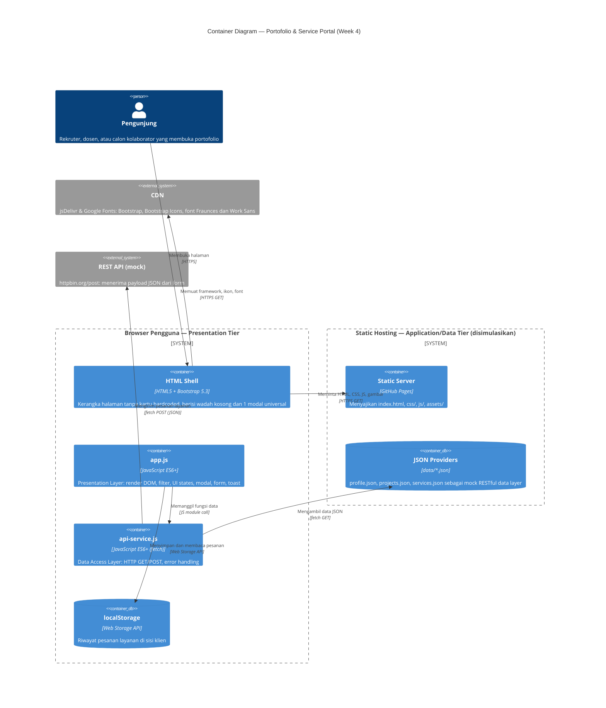
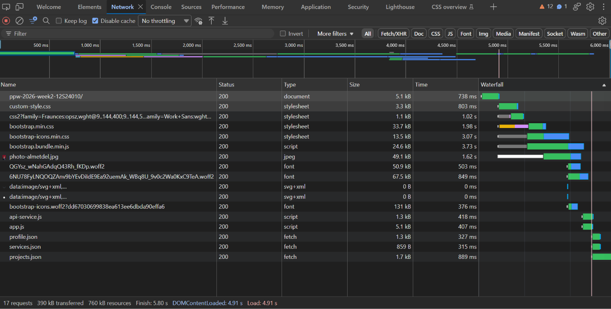
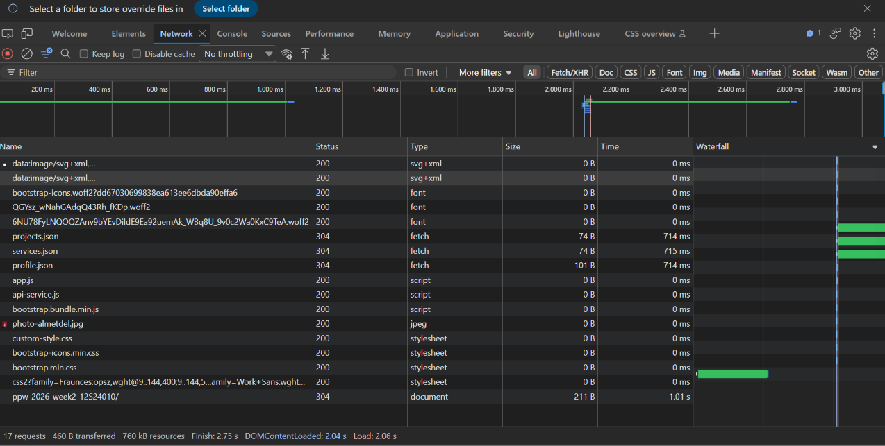
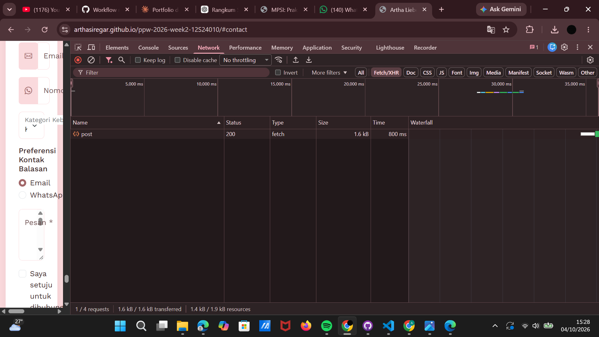

# Portofolio & Service Portal — Artha Liebe Siregar

**NIM:** 12S24010 · **Kelas:** 13SI1 · **Mata Kuliah:** 12S3101 Pemrograman dan Pengujian Web
**Tugas:** Minggu 4 — Refactoring Arsitektural: Decoupled Multi-Tier, Dynamic Client-Side Rendering (CSR), dan Network Performance Profiling

| | |
|---|---|
| 🔗 **Live demo** | https://arthasiregar.github.io/ppw-2026-week2-12S24010/ |
| 🔗 **Repositori** | https://github.com/Arthasiregar/ppw-2026-week2-12S24010/tree/week4-architecture |
| 🌿 **Branch** | `week4-architecture` |

> Repositori ini adalah kelanjutan dari proyek Minggu 2 dan Minggu 3 (nama repositori `week2` dipertahankan agar riwayat commit dan URL GitHub Pages tetap sama). Seluruh pekerjaan Minggu 4 berada di branch `week4-architecture`.

---

## 1. Ringkasan Pembaruan Minggu 4

Pada Minggu 3, portofolio dibangun dengan Bootstrap 5.3, tetapi seluruh konten (bio, keahlian, kartu proyek, modal, pengalaman, pendidikan, kontak) masih **hardcoded** di `index.html` (monolitik statis). Pada Minggu 4, `index.html` diubah menjadi **shell kosong**, dan seluruh konten diambil secara asinkron dari berkas JSON lalu dirakit di browser (Client-Side Rendering).

Perubahan utama:

- Data dipisah ke `data/profile.json`, `data/projects.json`, dan `data/services.json`.
- Pemisahan kode menjadi **Data Access Layer** (`js/api-service.js`) dan **Presentation Layer** (`js/app.js`).
- Pengambilan data memakai `fetch()` dengan `async/await` dan penanganan error defensif.
- **4 UI State** pada bagian proyek: Loading, Success, Empty, Error.
- **Filter kategori** instan (Semua / Independen / Tim / Berpasangan).
- **Universal Dynamic Modal**: 1 modal untuk semua proyek (menggantikan 5 modal terpisah).
- Section baru **Layanan** (Service Portal) dari `services.json`.
- Form kontak dikirim lewat **fetch POST** (JSON) tanpa reload, dengan umpan balik **Toast**, dan riwayat pesanan disimpan di **localStorage**.
- **Content Security Policy** (CSP) dan sanitasi masukan untuk mencegah DOM-based XSS.

---

## 2. Diagram Arsitektur — C4 Container Model



> Jika diagram Mermaid tidak tampil di GitHub, ekspor lewat [mermaid.live](https://mermaid.live) sebagai gambar lalu simpan di `docs/c4-container.png`.

### Pemetaan ke Arsitektur Multi-Tier

| Tier | Komponen di proyek ini | Tanggung jawab |
|---|---|---|
| **Presentation Tier** | `index.html`, `css/custom-style.css`, `js/app.js` | Antarmuka, responsivitas, interaksi, UI states |
| **Application / API Logic Tier** | `js/api-service.js`, `httpbin.org/post` | Kontrak pengambilan dan pengiriman data, error handling, endpoint REST mock |
| **Data Storage Tier** | `data/*.json` (sumber), `localStorage` (state sisi klien) | Penyimpanan data portofolio dan riwayat pesanan |

### Narasi Separation of Concerns (SoC)

Pada Minggu 3, satu berkas `index.html` menanggung tiga tanggung jawab sekaligus: struktur, konten, dan perilaku. Mengubah satu judul proyek berarti mengedit markup di dua tempat (kartu dan modal), sehingga rawan tidak konsisten.

Pada Minggu 4, tanggung jawab dipisah menjadi lapisan yang masing-masing punya satu alasan untuk berubah:

1. **Data** (`data/*.json`) berubah ketika konten berubah. Menambah proyek cukup dengan menambah satu objek JSON, tanpa menyentuh HTML atau JavaScript.
2. **Data Access Layer** (`api-service.js`) berubah ketika cara mengambil data berubah, misalnya endpoint pindah ke backend sungguhan. `app.js` tidak perlu diubah karena hanya memanggil fungsi `ApiService`.
3. **Presentation Layer** (`app.js`) berubah ketika tampilan atau interaksi berubah.
4. **Struktur dan gaya** (`index.html`, `custom-style.css`) hanya mengurus kerangka dan tema visual.

Manfaatnya: kode lebih mudah dirawat, data dan tampilan dapat diuji terpisah, dan satu sumber kebenaran (single source of truth) menghilangkan duplikasi antara kartu dan modal.

### Komparasi Paradigma Rendering

| Parameter | SSR | CSR (proyek ini) | Jamstack |
|---|---|---|---|
| Perakitan DOM | Di server per request | Di browser via JavaScript | Saat build, lalu dihidrasi via API |
| Beban server | Tinggi | Sangat rendah (hanya mengirim berkas statis dan JSON) | Minimal (disajikan CDN) |
| TTFB | Menengah–lambat | Cepat (HTML shell kecil) | Sangat cepat |
| Interaktivitas | Reload tiap navigasi | Mulus, filter dan modal instan | Mulus |
| Hosting | Server aktif terus | Static hosting (GitHub Pages) | Static CDN + serverless/API |
| Kelemahan | Beban server, reload | Konten kosong sebelum JS selesai; SEO lebih lemah | Perlu proses build |

Proyek ini memakai **CSR di atas static hosting** yang cocok dengan pola Jamstack: HTML shell disajikan statis, data diambil dari JSON, dan form dikirim ke REST endpoint eksternal.

---

## 3. Tabel Perbandingan: Sebelum vs Sesudah Refactoring

| Aspek | Sebelum (Minggu 3) | Sesudah (Minggu 4) |
|---|---|---|
| **Arsitektur** | Monolitik statis, semua konten di `index.html` | Decoupled multi-tier: shell HTML + JSON + Data Access Layer + Presentation Layer |
| **Sumber data** | Hardcoded di HTML | `data/profile.json`, `data/projects.json`, `data/services.json` |
| **Kartu proyek** | 5 kartu ditulis manual | Dirender dinamis dari `projects.json` (CSR) |
| **Modal proyek** | 5 modal terpisah (`modalPortofolio`, `modalExpense`, `modalImunku`, `modalClinic`, `modalAcademic`) | 1 modal universal (`universalProjectModal`), isi diinjeksi berdasarkan ID proyek |
| **UI State** | Tidak ada | Loading, Success, Empty, Error |
| **Filter proyek** | Tidak ada | Filter kategori instan tanpa reload |
| **Section Layanan** | Tidak ada | Ada, dari `services.json` |
| **Form kontak** | `action="mailto:"` membuka aplikasi email | `fetch` POST berisi JSON ke REST endpoint, tanpa reload |
| **Umpan balik form** | Validasi Bootstrap saja | Validasi, tombol loading, dan Toast |
| **State klien** | Tidak ada | Riwayat pesanan di `localStorage` |
| **JavaScript** | Skrip validasi inline | Modul terpisah `api-service.js` dan `app.js` |
| **Keamanan** | Tanpa CSP | CSP via `<meta>`, sanitasi dengan `escapeHTML` / `textContent` |
| **Struktur folder** | `index.html` + `custom-style.css` | `css/`, `js/`, `data/`, `assets/` |
| **Menambah proyek** | Edit HTML di dua tempat (kartu + modal) | Tambah satu objek di `projects.json` |

---

## 3A. Desain Data Layer JSON

Seluruh konten berada di `data/` dan dibaca lewat `ApiService` (`fetch` + `async/await`, error dilempar dengan pesan HTTP yang jelas).

| Berkas | Isi | Jumlah |
|---|---|---|
| `profile.json` | `name`, `role`, `bio`, `facts[]`, `techStack[]`, `canDo[]`, `contact`, `socials[]`, `education[]`, `experience[]` | 1 objek |
| `projects.json` | `id`, `title`, `category`, `accent`, `icon`, `image`, `description`, `detail`, `tags[]`, `role`, `metric`, `year`, `status`, `link` | 5 proyek |
| `services.json` | `id`, `name`, `tagline`, `description`, `price`, `features[]`, `highlight` | 3 paket layanan |

Contoh satu entri `projects.json`:

```json
{
  "id": "imunku",
  "title": "ImunKu — Jadwal Imunisasi Anak",
  "category": "Tim",
  "accent": "coral",
  "icon": "bi-heart-pulse",
  "image": "assets/images/projects/imunku.png",
  "tags": ["Figma", "UI/UX Research", "Prototyping"],
  "role": "Frontend Developer",
  "metric": "95.8% Success Rate",
  "link": "https://docs.google.com/presentation/d/..."
}
```

Nilai `category` (`Independen`, `Tim`, `Berpasangan`) dipakai langsung oleh tombol filter, dan `id` dipakai Universal Modal untuk menemukan proyek yang diklik.

---

## 4. Struktur Berkas

```
ppw-2026-week2-12S24010/
├── index.html                  # Shell HTML5 + Bootstrap 5, tanpa kartu hardcoded
├── css/
│   └── custom-style.css        # Tema, CSS variables, override Bootstrap
├── data/
│   ├── profile.json            # Biodata, fakta singkat, keahlian, pengalaman, pendidikan, kontak
│   ├── projects.json           # Koleksi proyek (metrics, tags, image, link)
│   └── services.json           # Katalog paket layanan
├── js/
│   ├── api-service.js          # Data Access Layer (fetch GET/POST, error handling)
│   └── app.js                  # Presentation Layer (render, filter, modal, form, toast)
├── assets/
│   ├── images/
│   │   ├── photo-almetdel.jpg
│   │   └── projects/           # Thumbnail proyek (path relatif, sesuai CSP img-src 'self')
│   └── CV_ARTHA_SIREGAR.pdf
├── docs/                       # Screenshot waterfall DevTools (dan diagram C4 jika diekspor)
│   ├── waterfall-cold.png
│   ├── waterfall-warm.png
│   └── network-form-post.png
└── README.md
```

> Catatan: GitHub Pages membedakan huruf besar dan kecil pada nama berkas. `CV_ARTHA_SIREGAR.pdf` harus persis sama dengan yang dipanggil di `index.html`.

---

## 5. Fitur Utama

- **Dynamic CSR** — hero, keahlian, proyek, layanan, pengalaman, pendidikan, dan kontak dirender dari JSON memakai `async/await`.
- **4 UI State pada proyek**
  - *Loading*: spinner "Memuat data proyek…"
  - *Success*: grid kartu responsif (`row-cols-1 row-cols-md-2 row-cols-lg-3`)
  - *Empty*: pesan jika kategori filter tidak berisi proyek
  - *Error*: alert merah jika JSON gagal dimuat
- **Filter kategori** — Semua, Independen, Tim, Berpasangan.
- **Universal Dynamic Modal** — satu modal, isi berubah sesuai ID proyek, dibuka lewat Bootstrap Modal API.
- **Service Portal** — katalog layanan dari `services.json`. Tombol "Pesan Layanan" mengisi kategori dan pesan di form secara otomatis, lalu menggulir halaman ke form kontak.
- **Pemuatan data paralel** — profil, layanan, dan proyek dimuat bersamaan dengan `Promise.allSettled`, sehingga kegagalan satu berkas tidak menghentikan section lain.
- **Form REST asinkron** — `preventDefault`, serialisasi ke JSON, `fetch` POST ke `https://httpbin.org/post`, tombol submit berubah menjadi status "Mengirim…", Toast sukses/gagal, lalu form direset.
- **Persistensi lokal** — pesanan disimpan di `localStorage` dan ditampilkan lewat badge di bagian kontak.
- **Aksesibilitas** — skip link, HTML semantik, label form, `aria-label`, `role="alert"`.
- **Tema** — palet cream, pink, koral, dan mauve melalui CSS custom properties, tanpa `!important`.

---

## 6. Keamanan Sisi Klien

### Sanitasi DOM-based XSS
Nilai dari JSON yang disisipkan ke DOM diperlakukan sebagai data tidak tepercaya:

- Teks biasa (nama, peran, bio, judul modal, kontak) memakai `textContent`.
- Jika harus memakai `innerHTML` (template kartu, modal, layanan, toast), setiap nilai dinamis dilewatkan fungsi `escapeHTML()` terlebih dahulu. Fungsi ini mengganti `& < > " '` sehingga aman dipakai pada isi elemen maupun nilai atribut HTML.
- URL dari JSON (`link`, `url`) divalidasi lewat `safeUrl()`: hanya protokol `http` dan `https` yang diterima, nilai seperti `javascript:` diganti `#`.
- Endpoint `httpbin.org` hanya mock REST untuk praktikum; data yang dikirim saat pengujian adalah data dummy.

### Content Security Policy

| Direktif | Nilai | Alasan |
|---|---|---|
| `default-src` | `'self'` | Blokir semua sumber luar secara default |
| `style-src` | `'self' 'unsafe-inline' https://cdn.jsdelivr.net https://fonts.googleapis.com` | Bootstrap, Bootstrap Icons, Google Fonts; `unsafe-inline` dipakai untuk atribut `style` pada Toast container dan textarea |
| `font-src` | `'self' https://fonts.gstatic.com https://cdn.jsdelivr.net` | File font Google Fonts dan Bootstrap Icons |
| `script-src` | `'self' https://cdn.jsdelivr.net` | Hanya skrip lokal dan Bootstrap JS; tanpa skrip inline |
| `img-src` | `'self' data:` | Gambar lokal dan data URI |
| `connect-src` | `'self' https://httpbin.org` | `fetch` ke JSON lokal dan REST endpoint mock |

---

## 7. Pengukuran Network Profiling (DevTools)

**Lingkungan uji:** Microsoft Edge / Chrome, DevTools → tab Network, URL: https://arthasiregar.github.io/ppw-2026-week2-12S24010/

- **Cold Load**: *Disable cache* dicentang, lalu *hard reload* (Ctrl+Shift+R).
- **Warm Load**: *Disable cache* dimatikan, lalu muat ulang biasa (F5) setelah cold load.

### 7.1 Cold Load vs Warm Load

> Isi dengan hasil pengukuran sendiri. Ambil nilai **DOMContentLoaded** dan **Load** dari bar bawah tab Network, **TTFB** dari tab *Timing* pada request `index.html`, dan **FCP** dari tab Lighthouse atau Performance.

| Metrik | Cold Load | Warm Load | Selisih |
|---|---|---|---|
| TTFB `index.html` | … ms | … ms | … |
| First Contentful Paint (FCP) | … ms | … ms | … |
| DOMContentLoaded | … ms | … ms | … |
| Load | … ms | … ms | … |
| Jumlah request | … | … | … |
| Data ditransfer | … kB | … kB | … |

### 7.2 Analisis Caching per Berkas

> Klik tiap berkas di tab Network, lihat *Response Headers* (`Cache-Control`, `ETag`) dan kolom *Status*.

| Berkas | Status Cold | Status Warm | `Cache-Control` | `ETag` ada? | Keterangan |
|---|---|---|---|---|---|
| `index.html` | 200 | … (200 / 304) | … | … | … |
| `css/custom-style.css` | 200 | … | … | … | … |
| `js/app.js` | 200 | … | … | … | … |
| `js/api-service.js` | 200 | … | … | … | … |
| `data/projects.json` | 200 | … | … | … | … |
| `data/profile.json` | 200 | … | … | … | … |
| `data/services.json` | 200 | … | … | … | … |
| `bootstrap.min.css` (CDN) | 200 | … (disk/memory cache) | … | … | … |

### 7.3 Analisis

Tuliskan 3–5 kalimat tentang:

1. Berkas mana yang menghasilkan **304 Not Modified**, dan apa artinya (server memvalidasi `ETag`, body kosong, bandwidth hemat).
2. Berkas mana yang dilayani langsung dari **disk/memory cache** tanpa request ke server (`max-age`).
3. Penyebab selisih Cold vs Warm Load.
4. Dampak arsitektur CSR: urutan **waterfall** (HTML → CSS/JS → JSON → render) dan efeknya pada FCP.

**Catatan strategi caching.** Berkas JSON diambil dengan `cache: 'no-cache'`, sehingga browser selalu memvalidasi ke server dan menerima 304 selama konten tidak berubah. Aset statis (CSS, JS, gambar) mengikuti `cache-control` dari GitHub Pages. Sesuaikan kalimat ini dengan status yang benar-benar tampil pada kolom Status hasil pengukuranmu.

**Catatan pemuatan paralel.** Ketiga berkas JSON diminta bersamaan lewat `Promise.allSettled`, sehingga pada waterfall request-nya tidak berbentuk tangga.

**Catatan tabel rekap.** Tabel rekap di bagian Proyek mencakup matakuliah yang masih berjalan dan belum dipublikasikan sebagai kartu, sehingga isinya tidak identik dengan `projects.json`.

### 7.4 Screenshot Waterfall

| Cold Load | Warm Load |
|---|---|
|  |  |

### 7.5 Pengiriman Form (Preflight CORS)

Pengiriman form ke `httpbin.org` menghasilkan dua request: preflight `OPTIONS` (karena cross-origin dan `Content-Type: application/json`) diikuti `POST`.

| Request | Status | Waktu |
|---|---|---|
| `OPTIONS /post` | … | … ms |
| `POST /post` | … | … ms |



---

## 8. Cara Menjalankan Secara Lokal

> Halaman ini memakai `fetch()` untuk membaca JSON, sehingga **tidak bisa dibuka dengan klik dua kali** (`file://`). Gunakan server lokal.

1. Clone repositori dan pindah ke branch Minggu 4:
   ```bash
   git clone https://github.com/Arthasiregar/ppw-2026-week2-12S24010.git
   cd ppw-2026-week2-12S24010
   git checkout week4-architecture
   ```
2. Buka folder di VS Code, klik kanan `index.html`, lalu pilih **Open with Live Server**.
3. Pastikan ada koneksi internet karena Bootstrap, Bootstrap Icons, dan Google Fonts dimuat dari CDN.

---

## 9. Alur Kerja Git

```bash
git checkout -b week4-architecture
git add .
git commit -m "feat(week4): decouple architecture to json data providers and async CSR"
git push -u origin week4-architecture
```

GitHub Pages: **Settings → Pages → Source: branch `week4-architecture`**.

---

## 10. Riwayat Pembaruan

| Minggu | Fokus |
|---|---|
| 2 | HTML5 semantik dan CSS murni |
| 3 | Integrasi Bootstrap 5.3, custom theming, modal, form modern |
| 4 | Decoupled multi-tier, Dynamic CSR, Universal Modal, form REST, profiling DevTools |

---

Disusun oleh **Artha Liebe Siregar** (12S24010) untuk Mata Kuliah Pemrograman dan Pengujian Web (12S3101), Institut Teknologi Del.